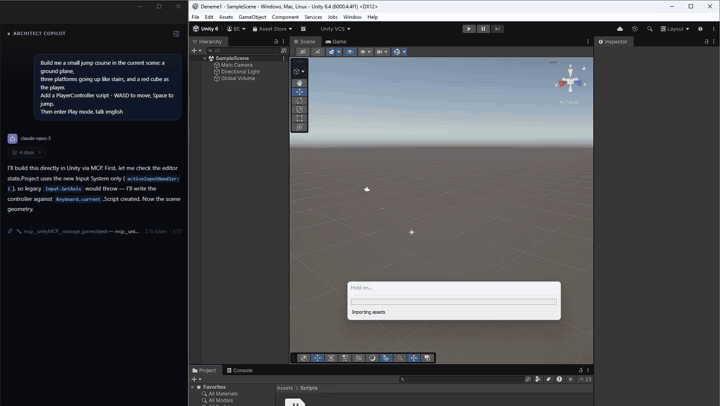

<div align="center">

# Unity Architect AI

**Tüm kodlama ajanlarını ve canlı Unity kontrolünü tek bir masaüstü uygulamasında birleştiren agentic geliştirme stüdyosu**

[](https://python.org)
[](https://fastapi.tiangolo.com)
[](https://electronjs.org)
[](https://react.dev)
[](https://typescriptlang.org)
[](./unity-mcp)
[](LICENSE)

*Claude Code, Codex, Antigravity (agy), bulut API'leri ve canlı Unity Editor kontrolü — hepsi aynı sohbet penceresinde, aynı onay sisteminin arkasında, aynı projeyi tanıyarak çalışır.*

[English README](./README_EN.md)

<br/>



*Kod editöründe doğal dille geliştir, ardından Unity Editor'ü canlı olarak kontrol et — tek pencereden.*

</div>

---

## İçindekiler

- [Tek Çatı Altında: Bu Proje Neyi Birleştiriyor?](#-tek-çatı-altında-bu-proje-neyi-birleştiriyor)
- [Neden Unity Architect AI?](#-neden-unity-architect-ai)
- [Özellikler](#-özellikler)
- [Sistem Mimarisi](#-sistem-mimarisi)
- [Desteklenen AI Sağlayıcılar](#-desteklenen-ai-sağlayıcılar)
- [Tool Ekosistemi (MCP + Function Calling)](#-tool-ekosistemi-mcp--function-calling)
- [Onay & Güvenlik Mimarisi](#-onay--güvenlik-mimarisi)
- [Kurulum](#-kurulum)
- [Paketleme (dmg / exe)](#-paketleme-dmg--exe)
- [Kullanım](#-kullanım)
- [Unity MCP Entegrasyonu](#-unity-mcp-entegrasyonu)
- [Agentic Sistem Detayları](#-agentic-sistem-detayları)
- [Geliştirici Notları: Alınan Dersler](#-geliştirici-notları-alınan-dersler-ve-mimari-kararlar)
- [Katkıda Bulunma](#-katkıda-bulunma)

---

## 🎯 Tek Çatı Altında: Bu Proje Neyi Birleştiriyor?

Bugün bir Unity geliştiricisi farklı işler için farklı pencereler açmak zorunda: kod üretmek için bir CLI, Editor'ü kontrol etmek için ayrı bir eklenti, sohbet için bir başka uygulama. Her birinin kendi onay mantığı, kendi konfigürasyonu, projeden kendi kopuk görüşü var.

**Unity Architect AI bunların hepsini tek bir uygulamada toplar** — ve hepsini *tek bir onay kapısının* arkasına alır. Bir modeli açılır menüden seçersin; ister Claude Code CLI olsun, ister Codex, ister Antigravity (agy), ister GitHub Copilot CLI, ister doğrudan bulut API'si — hepsi:

- **aynı sohbet penceresinde** çalışır,
- **aynı projeyi** workspace olarak görür,
- **aynı dosya/terminal onay kartlarını** gösterir (hiçbir model onay almadan tek bir byte değiştiremez),
- ve istenirse **aynı canlı Unity Editor'e** MCP üzerinden komut verir.

### Ajan × Yetenek Matrisi

| | Sohbet & Analiz | Dosya yaz/düzenle (onaylı) | Terminal (onaylı) | Canlı Unity Editor kontrolü | Auth kaynağı |
|---|:---:|:---:|:---:|:---:|---|
| **Claude Code** (CLI) | ✅ | ✅ MCP | ✅ MCP | ✅ unityMCP | Anthropic aboneliğin |
| **Codex** (CLI) | ✅ | ✅ MCP | ✅ MCP | ✅ unityMCP | OpenAI aboneliğin |
| **Antigravity / agy** (CLI) | ✅ | ✅ `unityai` köprüsü | ✅ köprü | ✅ unityMCP (HTTP) | Google aboneliğin |
| **GitHub Copilot** (CLI) | ✅ | ✅ MCP | ✅ MCP | ✅ unityMCP | Copilot aboneliğin |
| **Bulut API** (Claude/GPT/Gemini/…) | ✅ | ✅ function calling | ✅ function calling | ✅ function calling | Kendi API anahtarın |
| **Ollama** (yerel) | ✅ | ✅ (uyumlu modeller) | ✅ | ⚠️ kısmi | Maliyet yok, offline |

Bu matrisin sağladığı şey basit ama nadir: **kaynak ne olursa olsun deneyim aynı.** Codex'ten Claude Code'a geçmek bir açılır menü; alıştığın diff ekranı, terminal onayı ve Unity entegrasyonu olduğu gibi kalır.

> **Önemli ayrım:** Onay kartları **dosya yazma/silme ve terminal** için çıkar. **Canlı Unity sahne işlemleri** (unityMCP araçları) bilinçli olarak **onaysız** çalışır — yani "sahneye bir karakter ekle" dediğinde AI sahneyi sormadan kurar. Ayrıntı: [Onay kapsamı](#️-onay-kapsamı-neyin-onaylandığı-neyin-onaylanmadığı-dürüstlük-notu).

---

## 🚀 Neden Unity Architect AI?

Unity ekosistemindeki AI araçları genelde iki uçtan birine düşer: ya sadece kod yazar, ya da sadece sohbet eder. Gerçek bir geliştirme ortağının yaptığını — projeyi anlamak, hatayı bulmak, düzeltmek, terminalde test etmek ve Unity Editor'de görmek — tek başına yapamaz.

| Geleneksel AI Asistanlar | Unity Architect AI |
|---|---|
| Tek sağlayıcıya kilitli | Claude Code, Codex, agy, Copilot CLI, 8+ bulut API (NVIDIA NIM ücretsiz havuz dahil), Ollama — tek menüden |
| Kod yazar, projeyi görmez | Workspace'teki tüm `.cs` dosyalarını tarar, mimari haritasını çıkarır |
| Dosya sistemine erişemez | Dosya oku/yaz/sil — her tehlikeli işlem onay kartıyla |
| Unity Editor'den habersiz | MCP ile sahneye GameObject ekler, bileşen bağlar, konsolu okur |
| Terminal çalıştıramaz | Güvenli terminal katmanı; tehlikeli komutlar onay ister |
| Her sohbet sıfırdan başlar | Kalıcı hafıza + proje analizi ile bağlamı korur |
| Kurulum derdi | `uv`, OmniSharp + .NET runtime, ffmpeg/yt-dlp — hepsi **uygulamaya gömülü**, sıfır ek kurulum |

---

## ✨ Özellikler

### Çoklu Ajan, Tek Deneyim
- Claude Code / Codex / agy / GitHub Copilot CLI ajanları + Anthropic, Google, OpenAI, NVIDIA NIM (ücretsiz havuz: GLM 5.2, Qwen3 Coder 480B, Nemotron 3…), Groq, DeepSeek, Moonshot bulut API'leri + Ollama yerel modelleri
- CLI seçilince backend, o aracın MCP konfigürasyonunu **çağrı anında otomatik** yazar (`~/.claude.json`, `~/.codex/config.toml`, `~/.gemini/antigravity-cli/mcp_config.json`; Copilot'ta session-bazlı `--additional-mcp-config`)
- **Şeffaf hot-swap**: Gemini CLI kapanırken `gemini-*` model ID'leri korundu, backend bunları sessizce Antigravity (`agy`) motoruna yönlendiriyor — frontend hiç değişmedi

### Otonom Agentic Loop
- AI görevi alır → düşünür → araç çağırır → sonucu değerlendirir → döngü tamamlanana kadar devam eder
- Maksimum 15 iterasyon ile sonsuz döngü koruması
- Her adım canlı (SSE) akar: `thinking` → `tool_call` → `tool_result` → `response`
- "Durdur" butonu hem SSE bağlantısını keser hem de backend'deki bekleyen tüm onay kapılarını reddeder (iki katmanlı iptal)

### Onay Kapısı Sistemi (her ajan için aynı)
- Dosya yazma → yan yana **diff görüntüleyici** (mevcut vs. yeni)
- Dosya silme → içerik önizlemeli silme onayı
- Terminal komutu → komutu gösteren onay kartı
- CLI ajanları (MCP/`unityai` köprüsü), bulut API'leri (function calling) — hepsi **aynı** onay UI'ından geçer

### Canlı Unity Editor Kontrolü (gömülü, sıfır kurulum)
- [CoplayDev/unity-mcp](https://github.com/CoplayDev/unity-mcp) tabanlı 40+ Unity Editor aracı
- Sahne, GameObject, bileşen, prefab, materyal, fizik, animasyon, build ayarları
- `uv` araç zinciri **uygulamaya gömülü** (macOS arm64+x64, Windows x64) — kullanıcının makinesinde `uv` kurulu olmasa da çalışır
- Tek tıkla toggle: Unity Editor açıkken aç, yeşile dönünce hazır

### Proje Farkındalığı (RAG)
- Workspace'teki tüm `.cs` dosyaları taranır, anlamlı parçalara (chunk) bölünür ve keyword tabanlı aramayla ilgili kod çekilir
- "Projeyi Öğren" → sınıfları, kalıtım ilişkilerini ve önemli metotları çıkarıp **mimari harita** üretir, kullanıcıya özet + kendi hafızasına teknik not yazar
- `/compact` ile uzun sohbetler AI tarafından özetlenir, bağlam token limiti aşılmadan korunur

### OmniSharp Kod Zekası (gömülü, sıfır kurulum)
- **OmniSharp LSP** sidecar — gerçek Roslyn tabanlı C# analizi; hatalar Monaco editöründe gösterilir
- Gerektirdiği **.NET runtime da uygulamaya gömülü** (macOS/Linux) — kullanıcının makinesinde .NET kurulu olması gerekmez
- Unity projesinin `Assets/` ve paket referanslarını çözümleyerek çalışır (el yapımı linter söküldü, yerine tam LSP geldi)

### Gerçek Effort Kontrolü
- Segmented **effort seçici** (Auto varsayılan) — seçim her sağlayıcıda **gerçekten** etki eder, süs değil
- Provider-farkında kayıtçı: Codex'te `model_reasoning_effort`, Gemini'de `thinking_level`/`thinkingBudget`, Claude'da düşünme bütçesi — model hangi seviyeleri destekliyorsa arayüz onları gösterir

### Video → Sohbet
- Sohbete video linki/dosyası at: gömülü **ffmpeg + yt-dlp** ile kareler ve transkript çıkarılır, görsel analiz hattına katılır
- Süreye göre akıllı kare bütçesi + kare tekilleştirme — token maliyeti kontrol altında

### Otomatik Güncelleme Bildirimi
- GitHub Releases üzerinden **yeni sürüm bildirimi** (electron-updater) — sessiz indirme/kurulum yok, karar kullanıcının

### Profesyonel IDE Arayüzü
- **Monaco Editor** (VS Code motoru) — Unity C# sözdizimi
- **Entegre terminal** (xterm.js + node-pty) — gerçek PTY, sistem komutları
- **Diff görüntüleyici**, **canlı düşünce bloğu** (Claude Extended Thinking / Gemini thinking stream)
- **Model seçici** — sağlayıcılar arası anında geçiş
- **İki dilli arayüz (TR/EN)** — React Context + `useLang()`, 100+ çeviri anahtarı, localStorage ile kalıcı

---

## 🏗 Sistem Mimarisi

```
┌──────────────────────────────────────────────────────┐
│                   Electron Masaüstü App                │
│  ┌──────────────────────────────────────────────────┐ │
│  │  main/background.ts — LOCAL_APP_TOKEN = uuid()     │ │
│  │  ├─► Backend subprocess env                        │ │
│  │  ├─► Unity MCP subprocess env                      │ │
│  │  └─► Renderer IPC: 'app-token-get'                 │ │
│  └──────────────────────────────────────────────────┘ │
│  ┌─────────────┐  ┌──────────────┐  ┌─────────────┐    │
│  │ Chat Panel  │  │Monaco Editor │  │  Terminal   │    │
│  │ (SSE stream)│  │ (OmniSharp)  │  │ (xterm.js)  │    │
│  └──────┬──────┘  └──────────────┘  └─────────────┘    │
│         │        React 18 + Next.js (TR/EN i18n)        │
└─────────┼──────────────────────────────────────────────┘
          │ HTTP / SSE   +   X-Session-Token header
          ▼
┌──────────────────────────────────────────────────────┐
│            FastAPI Backend (Python 3.13)               │
│  ┌─────────────────────────────────────────────────┐  │
│  │              AgentRunner (Agentic Loop)          │  │
│  │   İstek → Düşün → Araç Çağır → Sonuç → … → Yanıt │  │
│  └────────────────────┬────────────────────────────┘  │
│         ┌─────────────┼─────────────┐                  │
│         ▼             ▼             ▼                   │
│  ┌────────────┐ ┌──────────┐ ┌──────────────┐          │
│  │ToolRegistry│ │ProjectRAG│ │MemoryManager │          │
│  │read/write  │ │.cs tarama│ │/compact      │          │
│  │run_command │ │+ keyword │ │memories/*.md │          │
│  │search_proj │ │+ mimari  │ └──────────────┘          │
│  └────────────┘ └──────────┘                           │
│  ┌──────────────────────────────────────────────────┐ │
│  │                  AI Providers                     │ │
│  │  Claude │ OpenAI │ Gemini │ Groq │ … │ Ollama     │ │
│  └──────────────────────────────────────────────────┘ │
│  ┌──────────────────────────────────────────────────┐ │
│  │       unityai MCP Server (FastMCP)                │ │
│  │  save_file │ read_file │ list_directory │ bash    │ │
│  │            ↑ approval_bridge → onay kartı          │ │
│  └──────────────────────────────────────────────────┘ │
└─────────────────────────────────┬──────────────────────┘
                                  │ MCP (stdio / HTTP) + run_command köprüsü
          ┌───────────────────────┼───────────────────┐
          ▼                       ▼                    ▼
   ┌─────────────┐       ┌─────────────────┐   ┌──────────────────┐
   │ Claude Code │       │   Codex CLI     │   │ Antigravity (agy)│
   │ MCP native  │       │   MCP native    │   │ run_command →    │
   │             │       │                 │   │ unityai köprüsü  │
   └──────┬──────┘       └────────┬────────┘   └─────────┬────────┘
          └───────────────────────┼──────────────────────┘
                                  │ MCP HTTP (127.0.0.1:8080)
                                  ▼
                         ┌─────────────────┐
                         │   Unity MCP     │
                         │ (CoplayDev)     │  ← uvx gömülü
                         │  40+ tool       │
                         └────────┬────────┘
                                  ▼
                         ┌─────────────────┐
                         │  Unity Editor   │
                         │  (C# Plugin)    │
                         └─────────────────┘
```

### Dizin Yapısı

```
unityaıPython/
├── Backend/
│   ├── app/
│   │   ├── agentic/             # AgentRunner (agentic loop), onay kapıları
│   │   ├── providers/           # Sağlayıcı katmanı (bölünmüş)
│   │   │   ├── manager.py        #   provider seçimi (tek giriş noktası)
│   │   │   ├── cli_base.py       #   ortak CLI mantığı + MCP config yazımı
│   │   │   ├── claude_provider.py / codex_provider.py / agy_provider.py
│   │   │   └── api_providers.py  #   Anthropic/Gemini/OpenAI/Ollama SDK'leri
│   │   ├── unity_ai_mcp/        # Bizim MCP sunucumuz (FastMCP)
│   │   │   ├── tools/            #   save_file, delete_file, read_file, list_dir, bash
│   │   │   ├── approval_bridge.py#   MCP/CLI ↔ backend onay köprüsü
│   │   │   ├── unity_mcp_manager.py # Unity MCP subprocess + gömülü uvx
│   │   │   └── server.py
│   │   ├── unityai_cli.py       # agy için run_command köprüsü (aynı onay kapısı)
│   │   ├── tools/               # Function-calling ToolRegistry (bulut API yolu)
│   │   ├── rag/                 # ProjectRAG (tarama+keyword), MemoryManager
│   │   ├── routes/              # FastAPI router'ları (auth/chat/config/…)
│   │   ├── omnisharp/           # OmniSharp LSP sidecar (manager + client, gömülü .NET ile)
│   │   ├── auth_utils.py        # LOCAL_APP_TOKEN doğrulama
│   │   └── database.py          # SQLite — tek lokal kullanıcı (id=1), Fernet
│   ├── vendor/                  # fetch_uv (uv zinciri) + fetch_video_bins (ffmpeg/yt-dlp)
│   ├── backend.spec             # PyInstaller — frozen 'backend' binary
│   └── tests/
├── Frontend/frontend/
│   ├── renderer/                # home.tsx (IDE), components/, hooks/, lib/i18n.tsx
│   └── main/background.ts       # Electron ana süreç, LOCAL_APP_TOKEN + updater
├── scripts/fetch_omnisharp.py   # OmniSharp + .NET runtime indirir (third_party/, git'e girmez)
├── unity-mcp/                   # CoplayDev/unity-mcp fork'u (Server + MCPForUnity eklentisi)
└── docker-compose.yml
```

---

## 🤖 Desteklenen AI Sağlayıcılar

Sağlayıcılar **modelin nereden çalıştığına** göre 3 kategoriye ayrılır. Tool kullanımı (MCP / function calling) ayrı bir katmandır — bir sonraki bölümde.

### 1. Subscription CLI Ajanları (öne çıkan)

Backend, makinendeki resmi CLI aracını subprocess olarak çağırır; aracın kendi auth'unu (senin aboneliğin) kullanır. Tool kullanımı **MCP** ile — backend her çağrı öncesi gerekli config dosyasını yazar.

| CLI Aracı | Modeller (örnek) | Config Dosyası | Tool Mekanizması |
|---|---|---|---|
| **Claude Code** | claude-sonnet-5, claude-fable-5, claude-opus-4-8, claude-haiku-4-5 | `~/.claude.json` (user scope) | MCP native (stdio + HTTP) |
| **Codex** | gpt-5.6-sol/terra/luna, gpt-5.5, gpt-5.4 | `~/.codex/config.toml` | MCP native |
| **Antigravity (agy)** | Gemini 3.5 Flash + agy üzerinden Claude/GPT-OSS | `~/.gemini/antigravity-cli/` | `run_command` → `unityai` köprüsü |
| **GitHub Copilot** | copilot-auto + Claude/GPT/Gemini seçenekleri | session-bazlı `--additional-mcp-config` | MCP native (global config'e dokunulmaz) |

> **agy neden farklı?** agy'nin `--print` modu MCP sunucularını native yüklemez. Bu yüzden dosya/terminal işlemleri, `run_command` ile çağrılan ve MCP tool'larıyla **aynı onay kapısını paylaşan** bir `unityai` CLI köprüsü üzerinden yapılır. Detaylar: [Geliştirici Notları — agy Macerası, Sahne 7](#sahne-7-çözüm--yanlış-kapıyı-çalıyormuşum).

### 2. Cloud API (doğrudan API çağrısı)

Backend, sağlayıcının resmi SDK'sı veya OpenRouter gateway'i üzerinden istek atar. Tool kullanımı **function calling** ile (model JSON tool çağrısı üretir, `AgentRunner` dispatch eder).

| Sağlayıcı | Modeller (örnek) | Notlar |
|---|---|---|
| **Anthropic** | claude-sonnet-5, claude-fable-5, claude-opus-4-8, claude-haiku-4-5 | Extended Thinking, tool use |
| **Google** | gemini-3.5-flash, gemini-3.1-pro, gemini-3-flash | Thinking stream, vision |
| **OpenAI** | gpt-5.6-sol/terra/luna, gpt-5.5-pro, gpt-5.5, gpt-5.4 | Function calling, vision |
| **NVIDIA NIM** | GLM 5.2, Qwen3 Coder 480B, Nemotron 3 Ultra/Super, Mistral Large 3, Kimi K2.6… | Tek `nvapi-` anahtarıyla **ücretsiz havuz** (40 RPM) |
| **z-ai** | glm-5.2 | Açık ağırlık, 1M bağlam |
| **Groq** | llama-3.3-70b-versatile | Düşük gecikme (LPU) |
| **DeepSeek** | deepseek-chat (V3) | Uygun fiyat |
| **Moonshot / Kimi** | kimi-k2.6, kimi-k2.5 | Uzun bağlam |
| **OpenRouter** | Yukarıdakilerin hepsi `openrouter_id` ile | Tek anahtar, tüm sağlayıcılar (yedek yol) |

### 3. Local (Ollama)

`http://localhost:11434` yoklanır; yüklü tüm modeller dinamik listelenir. Sıfır maliyet, tam offline. Function calling destekleyen modeller (Llama 3.3, Qwen2.5 vb.) tool kullanabilir.

---

## 🔧 Tool Ekosistemi (MCP + Function Calling)

Tool kullanımı sağlayıcıdan **bağımsız** bir katmandır. Bir model dosya okumak/yazmak veya komut çalıştırmak istediğinde iki mekanizma vardır:

| Mekanizma | Kimler | Nasıl |
|---|---|---|
| **Function Calling** | Bulut API + Ollama | Model JSON tool çağrısı üretir → `AgentRunner` yakalar → `ToolRegistry`'den çalıştırır |
| **MCP** | Claude Code, Codex | CLI bir MCP client'tır → backend'in yazdığı config ile MCP sunucularına bağlanır → tool'ları stdio/HTTP ile çağırır |
| **run_command köprüsü** | agy | agy `unityai` CLI'ını `run_command` ile çağırır → CLI, MCP ile aynı onay kapısını kullanır |

### Backend'in çalıştırdığı MCP sunucuları

1. **unityai MCP** (`Backend/app/unity_ai_mcp/server.py`) — `save_file`, `delete_file`, `read_file`, `list_directory`, `bash`/`run_terminal_command`/`execute_shell_command`. Yazma/silme/komut işlemleri `approval_bridge` ile onay paneline yönlenir.
2. **Unity MCP** (CoplayDev/unity-mcp) — Unity Editor için 40+ tool (sahne, GameObject, prefab…), HTTP üzerinden `127.0.0.1:8080`.

### MCP config'leri ne zaman yazılır?

| Olay | Sonuç |
|---|---|
| Bulut API / Ollama seçilir | Config yazılmaz (function calling kullanılır) |
| CLI modeli seçilir | Henüz bir şey olmaz |
| **CLI ile mesaj gönderilir** | İlgili config dosyasına **unityai MCP** kaydı yazılır |
| **Unity MCP toggle açılır** | Unity MCP subprocess başlar; sonraki CLI çağrısında config'e `unityMCP` de eklenir |
| Toggle kapanır | Server durur, sonraki config'lerden `unityMCP` çıkarılır |

---

## 🛡 Onay & Güvenlik Mimarisi

Bir AI'nın terminal ve dosya sistemine erişimini güvenli kılmak için çok katmanlı savunma:

### 1. Dosya sistemi kilidi
- Tüm dosya işlemleri `workspace_path` ile sınırlı; `Path.resolve()` + prefix kontrolü ile workspace dışına çıkış reddedilir (hem backend MCP tarafında `_resolve`, hem Electron IPC tarafında `isAllowedWorkspacePath`).

### 2. Onay kapısı (tüm ajanlar için ortak)

```
AI bir dosya değiştirmek ister
          │
   Değişiklik var mı? (strip() karşılaştırma)
     │              │
    Hayır → "değişiklik yok"
     │
    Evet → onay kapısı açılır → UI'da DiffViewer
              │
        ┌─────┴─────┐
      Onayla       Reddet
        │             │
      Yazılır     "reddedildi" döner
```

CLI ajanları, bulut API'leri ve `unityai` köprüsü — **dosya ve terminal** işlemlerinde hepsi **aynı** `approval_bridge` / gate mekanizmasından geçer. Diske onay verilmeden tek byte yazılmaz.

### ⚠️ Onay kapsamı: neyin onaylandığı, neyin onaylanmadığı (dürüstlük notu)

Onay kapısı **dosya sistemi ve terminali** korur — Unity Editor'ün **canlı sahnesini** değil. Bu kasıtlı bir tasarım tercihidir:

| İşlem | Hangi araç | Onay? |
|---|---|:---:|
| Dosya oluştur / düzenle (.cs vb.) | `save_file` / `unityai save-file` / function calling | ✅ **Diff kartı çıkar** |
| Dosya sil | `delete_file` | ✅ **Silme kartı çıkar** |
| Terminal komutu | `bash` / `run_command` | ✅ (güvenli komutlar hariç) |
| Sahne / GameObject / bileşen / materyal değişikliği | **unityMCP araçları** (`manage_gameobject`, `manage_scene`…) | ❌ **Onaysız, doğrudan çalışır** |

Yani **"PlayerController.cs oluştur"** dersen onay kartı çıkar; ama **"sahneye yürüyen bir karakter yap"** dersen AI, unityMCP araçlarıyla GameObject'leri, bileşenleri ve sahneyi **sormadan** kurar (yalnızca bir `.cs` script yazması gerekirse o adım yine onay ister).

**Neden böyle?** unityMCP, Unity'nin canlı Editor'üne bağlı, geri-alınabilir (Ctrl+Z) sahne operasyonları yapar; her GameObject ekleme/taşıma için onay istemek akışı kullanılmaz hale getirirdi. Ayrıca bu araçlar CLI ajanlarına `trust: true` / `approval_mode = "approve"` ile sunulur — yani onay kararı bilinçli olarak unityMCP katmanına bırakılmıştır. Diske kalıcı yazma (kod dosyaları) ve terminal ise her zaman onaylıdır.

### 3. Terminal güvenliği
- Güvenli (salt-okuma) komutlar direkt çalışır; whitelist dışı her komut onay kartı gösterir
- `python3 -c "open().write()"`, `printf > path`, `echo > path` gibi terminal üzerinden dosya yazma girişimleri yakalanıp DiffViewer'a yönlendirilir
- CLI built-in yazma araçları (`Write`/`Edit`, agy `write_to_file` vb.) `disallowedTools`/`disabledTools` ile kapatılır → model onaylı kanala (`save_file` / `unityai`) düşmek zorunda kalır

### 4. Lokal token mimarisi (ephemeral)

Bu bir masaüstü uygulaması olduğu için OAuth/JWT/session DB katmanları **kaldırıldı**. Yerine uygulama-yaşam-süresi token'ı:

```
Electron başlar → randomUUID() ile token üretir
   ├─► Backend subprocess env'i (LOCAL_APP_TOKEN)
   ├─► Unity MCP subprocess env'i
   └─► Renderer'a IPC ile sunulur ('app-token-get')

Her HTTP isteği X-Session-Token header'ı ile gelir
   → auth_utils._check_token() env var'la karşılaştırır
       eşleşmezse 401 · eşleşirse user_id=1 (tek lokal kullanıcı)
```

- **API anahtarı şifrelemesi**: Fernet ile şifrelenir; anahtar `~/.unity_architect_ai/api_key_fernet.key` dosyasında deterministik tutulur (paketlenmiş imzasız binary Keychain'i güvenilir okuyamadığı için dosya-tabanlı çözüldü). `api_keys` tablosu yalnızca şifreli veri tutar.

---

## ⚙️ Kurulum

### Gereksinimler
- Python 3.13+
- Node.js 20+
- Unity Editor (Unity MCP için, isteğe bağlı)

> Paketlenmiş uygulamada bunların hiçbiri gerekmez — Python, uv, OmniSharp, .NET runtime, ffmpeg/yt-dlp hepsi gömülüdür. Bu gereksinimler yalnızca **kaynak koddan geliştirme** içindir.

### Backend

```bash
cd Backend
python3 -m venv venv
source venv/bin/activate          # Windows: venv\Scripts\activate
pip install -r requirements.txt

# Geliştirme sunucusu
uvicorn app.main:app --host 127.0.0.1 --port 8000 --reload
```

> API anahtarlarını `.env` ile değil, uygulama içindeki **Ayarlar** ekranından girersin (şifrelenerek saklanır). Backend'i Electron olmadan tek başına çalıştırırsan `LOCAL_APP_TOKEN` boş kalır → token kontrolü atlanır (dev mode).

### Frontend

```bash
cd Frontend/frontend
npm install          # postinstall node-pty'yi otomatik derler
npm run dev          # geliştirme
```

### Ortam değişkenleri (opsiyonel)

```env
DB_PATH=~/.unity_architect_ai/unity_master_v3.db
HOST=127.0.0.1
PORT=8000                      # Electron rastgele boş port seçer; sabit istiyorsan ayarla
API_KEY_ENCRYPTION_KEY=        # boşsa dosya-tabanlı anahtar üretilir
```

---

## 📦 Paketleme (dmg / exe)

Dağıtılabilir uygulama dört adımda üretilir (gömülü binary'lerin hiçbiri git'e konmaz, her build öncesi indirilir):

```bash
# 1) Unity MCP için uv araç zincirini indir
#    macOS: her iki mimari (arm64 + x64) indirilir
bash Backend/vendor/fetch_uv.sh
#    Windows: pwsh Backend/vendor/fetch_uv.ps1

# 2) OmniSharp + .NET runtime'ı indir (kod zekası; macOS/Linux'ta .NET de gömülür)
python3 scripts/fetch_omnisharp.py

# 3) Video araçlarını indir (ffmpeg + yt-dlp — video→sohbet özelliği)
bash Backend/vendor/fetch_video_bins.sh

# 4) Backend'i PyInstaller ile derle, sonra Electron'u paketle
cd Backend && ./build_backend.sh        # Windows: build_backend.bat
cd Frontend/frontend && npm install && npm run build
```

Çıktılar `Frontend/frontend/build/` altında:
- macOS: `Unity Architect AI-<sürüm>-arm64.dmg` (Apple Silicon)
- Windows: NSIS installer (`.exe`)

> ⚠️ **x64 dmg tuzağı:** electron-builder her iki mimari için dmg üretir ama backend binary'si yalnızca host mimaride derlenir — Apple Silicon'da alınan x64 dmg **Intel Mac'te çalışmaz**. Intel desteği için backend'i ayrıca x64 Python ile derlemek gerekir.

> 🍎 **macOS karantina notu:** dmg imzasızdır; internetten indirilince "hasar görmüş" uyarısı çıkarsa `xattr -cr "/Applications/Unity Architect AI.app"` ile karantina kaldırılır.

Paketlenmiş app'te Python veya .NET kurulu olması **gerekmez** — backend tek bir frozen binary'dir; `mcp-server` ve `unityai` alt komutları aynı binary üzerinden çağrılır. `uvx`, OmniSharp (+.NET) ve ffmpeg/yt-dlp uygulamaya gömülüdür.

---

## 💡 Kullanım

1. **Workspace seç** — Unity projenin klasörünü seç; backend `.cs` dosyalarını tarar.
2. **Model seç** — Ayarlar'dan sağlayıcı/model seç. Bulut API ise anahtarını gir (şifreli saklanır); CLI ise makinende kurulu olması yeter.
3. **Konuş** —

```
"PlayerController.cs'teki performans sorunlarını bul"
"Inventory için ScriptableObject tabanlı ItemData scripti oluştur"
"NullReferenceException PlayerController.cs:47 — sebebi ne, düzelt"
"Sahneye bir Player capsule ekle ve Rigidbody bağla"   # Unity MCP açıkken
/compact                                                # uzun sohbeti özetle
```

4. **Onayla** — AI dosya/komut işlemi isteyince akış durur, diff/komut kartı açılır; onayla veya reddet.

---

## 🎮 Unity MCP Entegrasyonu

[CoplayDev/unity-mcp](https://github.com/CoplayDev/unity-mcp) projesini birleştirir ve AI'a Unity Editor'ü doğrudan kontrol yeteneği verir.

### Kurulum: tamamen otomatik
1. Unity projeni aç (Editor açık olmalı)
2. Uygulamada **Unity MCP toggle**'ına bas
3. `unity_mcp_manager`, gömülü `uvx` ile MCP sunucusunu başlatır, paketi kurar ve Editor'le bağlantıyı kurar
4. Toggle yeşile dönünce (`Unity bağlandı ✓`) hazırdır

> Paketlenmiş app'te `uv`/`uvx` gömülü olduğu için kullanıcının ayrıca kurmasına gerek yoktur. Unity Editor kapalıysa toggle bağlanamaz — önce Unity'yi aç.

> **Onay davranışı:** unityMCP araçları (sahne/GameObject/bileşen) `trust: true` ile sunulur ve **onay kartı göstermez** — AI sahne değişikliklerini doğrudan yapar (Unity'de Ctrl+Z ile geri alınabilir). Onay yalnızca dosya yazma/silme ve terminal komutlarında çıkar. Bkz. [Onay kapsamı](#️-onay-kapsamı-neyin-onaylandığı-neyin-onaylanmadığı-dürüstlük-notu).

### Araçlar (40+)

| Kategori | Araçlar |
|---|---|
| Sahne | `manage_scene`, `find_gameobjects`, `manage_gameobject` |
| Bileşen | `manage_components`, `manage_physics`, `manage_animation` |
| UI/Kamera | `manage_ui`, `manage_camera` (screenshot dahil) |
| Prefab/Asset | `manage_prefabs`, `manage_scriptable_object`, `manage_asset` |
| Görsel | `manage_material`, `manage_shader`, `manage_texture`, `manage_graphics` |
| Script | `manage_script`, `script_apply_edits`, `validate_script`, `read_console` |
| Build | `manage_build`, `manage_packages`, `manage_editor` |
| Orkestrasyon | `batch_execute` (25 komuta kadar tek çağrı), `execute_code`, `execute_menu_item` |

### Ajan geri bildirimiyle evrilen fork

Bu fork'taki araçlar, gerçek gece-boyu ajan oturumlarının (Claude, GLM) geri bildirimleriyle sürekli iyileştiriliyor:

- **Token ekonomisi** — `get_hierarchy` varsayılan olarak hafif özet döner (`detail:"full"` ile ayrıntı); `find_gameobjects` sonuçları `name+path` özetiyle gelir (N+1 çağrı derdi yok)
- **Akıllı arama** — `find_gameobjects`'te `match_mode: exact|contains|prefix` ("Prop_" ile tüm prop'lar)
- **Tek turda yaz-derle-doğrula** — `wait_for_compile: true` ile script yazımı, derleme sonucunu ve konsol hatalarını aynı yanıtta getirir
- **Batch zincirleme** — `"$[0].data.instanceID"` referanslarıyla create→configure→parent tek `batch_execute`'ta
- **Dürüst geri bildirim** — play mode'da script değişikliği uyarı verir; hiçbir şey değiştirmeyen modify çağrısı `no_op` olarak raporlanır

### Çoklu Unity Instance

Birden fazla proje açıksa hangi instance'a komut gideceği seçilebilir (`set_active_instance`).

---

## 🧩 Agentic Sistem Detayları

### Araç Çantası (function-calling ToolRegistry)

```python
read_file(file_path)                 # Dosya oku (max 500 satır, özet)
write_file(file_path, content)       # Dosya yaz (onay)
delete_file(file_path)               # Dosya sil (onay)
list_directory(dir_path)             # Klasör listele
search_in_project(query, exts)       # Proje içi arama
find_files(pattern)                  # Dosya adı örüntüsü
run_command(command)                 # Terminal (tehlikeliyse onay)
save_to_memory(content) / recall_memory()   # Kalıcı hafıza
capture_unity_screenshot()           # Editor görüntüsü (görsel doğrulama)
```

### SSE Olay Akışı

```
POST /chat-stream → SSE açılır
event: thinking      → AI'ın düşünme metni
event: tool_call     → çağrılan araç + argümanlar
event: tool_result   → araç çıktısı özeti
event: response      → final yanıt (+ kod blokları)
event: context_usage → bağlam doluluk yüzdesi
event: done
```

---

## 📓 Geliştirici Notları: Alınan Dersler ve Mimari Kararlar

Bu bölüm projenin evrimindeki gerçek kararları, çıkmaz sokakları ve öğrenilen dersleri belgeler. Commit geçmişi "ne yaptığını" söyler; bu bölüm "neden" sorusunu yanıtlar.

---

### Başlangıç: "Analiz Aracı" Dönemi

Projeyi aslında bir Unity kod **analiz** aracı olarak başlattım. İlk versiyonda kullanıcı bir C# scripti yapıştırıyordu, sistem bunu statik analizden geçirip tek bir büyük JSON raporu dönüyordu. Çok sayıda ajan (intent classifier, orchestrator, unity expert, critic, game feel…) sırayla çalışıyordu.

**Sorun:** Bu pipeline 45-60 saniye sürüyordu. Kullanıcı "şu değişkenin adını düzelt" dediğinde bile tüm ajanlar tetikleniyordu.

**Ders:** Analitik mimari, interaktif geliştirme için yanlış paradigmadır. Rapor için 60 saniye kabul edilebilir; "şunu düzelt" için 60 saniye öldürücüdür.

---

### Büyük Geçiş: Analiz Aracından Agentic IDE'ye

Bu projenin en kritik mimari kararıdır. Önceki modelde kullanıcı sorar, tek seferlik yanıt gelir, sohbet biterdi — AI çalışma dosyalarını göremez, hata loglarını okuyamaz, terminale erişemezdi.

**Beni bu karara götüren şey:** "hata şu: NullReferenceException at PlayerController.cs:47, düzelt" mesajıydı. AI 47. satırı göremediği için sadece genel tavsiye verebiliyordu. Bir kıdemli ne yapardı? Dosyayı açar, satırı okur, bağlamı anlar, düzeltirdi.

```
Eski model:  Kullanıcı → [tek LLM çağrısı] → Yanıt
Yeni model:  Kullanıcı → [LLM] → araç çağrısı → [sonuç] → [LLM] → … → Yanıt
```

`AgentRunner` ve `ToolRegistry` bu geçişin ürünü.

---

### main.py: God Object'e Karşı Refactor

Bir noktada `main.py` 2000+ satıra ulaştı — auth, chat, OAuth, analiz, config hepsi tek dosyada. Tam bir route refactor yaptım:

```
Önce:  main.py (2000+ satır)
Sonra: routes/{auth,conversation,config,analysis,…}_routes.py + main.py (~30 satırlık bootstrap)
```

**Ders:** "Şimdilik buraya yazayım" kararı er ya da geç ödenir. 2000 satırlık dosya sadece kod borcu değil, bilişsel yük borcudur. (Aynı disiplinle sonradan `ai_providers.py` god-object'i de `providers/` altına bölündü.)

---

### MCP Kararı: Neden CLI Katmanı?

Kritik bir tercih: AI araçları doğrudan backend üzerinden mi çalışsın, yoksa CLI araçları (Claude Code, Codex, Gemini) üzerinden mi?

Doğrudan backend'in sorunu: her yeni model için tool calling'i yeniden yazmak, her modelin farklı formatını handle etmek, güvenlik sınırlarını sürekli yeniden inşa etmek.

CLI yaklaşımının avantajı: bu araçların kendi tool ekosistemi, güvenlik katmanı ve MCP desteği **zaten var**. Üzerlerine MCP sunucusu olarak konumlanmak, her CLI'nin gücünü miras almak demek.

```
Eski:  Frontend → Backend → [kendi tool kodum] → dosya sistemi
Yeni:  Frontend → Backend → CLI (MCP client) → MCP server → dosya sistemi
```

**Maliyet:** 3 farklı CLI config formatını (JSON / TOML / JSON) ve davranış farkını yönetmek.

---

### Gemini'nin Gizli Araç Çakışması

MCP üzerinden `write_file` aracı tanımladım. Gemini CLI'de görünmüyordu: `Tool 'mcp_..._write_file' not found`. Log analizi yerine doğrudan CLI'ye sordum:
> "Hangi MCP araçlarını görüyorsun, built-in listende `write_file` var mı?"

Cevap: Gemini'nin `write_file` adlı built-in aracı vardı ve aynı isimli MCP aracını **sessizce susturuyordu**. Adı `save_file` yapınca çözüldü.

**Ders:** CLI araçlarını debug ederken en hızlı yöntem log değil, aracın kendisine sormaktır.

---

### Stop Butonu: Görünüşte Basit, Gerçekte İki Katmanlı

"Durdur"a basınca AbortController ile SSE'yi kestim — ama backend CLI süreci hâlâ çalışıyor, onay için polling yapıyordu. Çözüm iki parça:

```typescript
stopMessage: () => {
  abortControllerRef.current?.abort();               // SSE bağlantısını kes
  fetch(`${API}/mcp-abort-all`, { method: 'POST' }); // Bekleyen onay kapılarını reddet
}
```

**Ders:** İptal semantiği birden fazla katmanı kapsar. "Frontend iptal etti" ≠ "işlem iptal edildi". Her async sınırın kendi iptal mekanizması olmalı.

---

### Auth'u Söktüm: Web Mimarisinden Lokal Desktop'a

Refleks olarak web paternleriyle başladım: bcrypt, JWT, session DB, OAuth2 (Google+GitHub), rate limiting — ~2000 satır, 4 tablo, 7 endpoint.

Bir gün fark ettim: **Bu bir Electron uygulaması.** Kullanıcı zaten cihazına fiziksel erişimi olan kişi. Multi-user katmanı sahte güvenlik veriyordu — saldırgan zaten `app_data/`'ya, API anahtarlarına, dosya sistemine erişebilir.

```typescript
const localAppToken = randomUUID()                 // her açılışta yeni
spawn(backend, { env: { ...process.env, LOCAL_APP_TOKEN: localAppToken } })
ipcMain.handle('app-token-get', () => localAppToken)
```

`users` tablosunda artık tek satır: `(id=1, username='local')`. Sessions/OAuth tabloları DROP edildi.

**Sonuç:** ~2000 satır silindi, 7 endpoint stub'a indi, 4 tablo kalktı, pytest %40 hızlandı.

**Ders:** Mimari, uygulama bağlamına uymalı. Web paternlerini lokal uygulamaya kopyalamak sadece teknik borç üretir.

---

### agy Macerası: CLI Embed Etmenin Sınırlarını Öğrendim (xD)

Projenin en büyük çıkmaz sokağıydı. Uzun süre bir **uyarı banner'ıyla** idare etti — ta ki doğru kanalı (`run_command` köprüsü) keşfedip **gerçekten çözene** kadar.

#### Sahne 1: "27 günümüz var"
Google'ın Gemini CLI'yi 27 günde kapatacağını öğrendim; yerine Antigravity (`agy`) geliyordu. Hot-swap basit görünüyordu: `--print` çağır, prompt'u stdin'den ver, çıktıyı oku. 3 saatlik iş gibi durdu. **Üç gün sürdü.**

#### Sahne 2: "Tool çağrıları nerede?"
agy text yanıt veriyordu ama dosya yazma isteklerinde MCP tool'ları **hiç çağrılmıyordu**. agy log'unda kritik satır: `checkpoint model generated tool calls`. agy'ye ve Codex'e sordum: **`--print` modu tool dispatch'i tasarım gereği engelliyor** dediler.

#### Sahne 3: "`-i` modu kullanırız!"
`--print` yerine interactive (`-i`) modu önerdiler. İlk deneme:
```
bubbletea: could not open TTY: open /dev/tty: device not configured
```
bubbletea (agy'nin TUI'si) PIPE'ı reddediyordu — gerçek bir PTY gerekiyordu.

#### Sahne 4: PTY ve Terminal Hijack Felaketi
`pty.openpty()`, `termios`, `start_new_session=True` — hepsi kitabına göre. Çalıştırdım: agy'nin TUI'si (sign-in, spinner, izin promptları) **kullanıcının terminaline** aktı, backend stdout'tan hiçbir şey okuyamadı. Üstelik `--dangerously-skip-permissions` bile `-i` modunda native shell promptlarını bypass etmiyordu.

#### Sahne 5: Araştırma — Yalnız Değiliz
GitHub'da `antigravity-cli` Issue #187 tam bizim sorunumuzdu, Google'dan yanıt yoktu. Gemini API dokümanında "Antigravity Agent: function_calling and mcp are not yet supported." Üç yol da kapalıydı.

#### Sahne 6: Kabul ve Banner
`--print`'e döndüm. agy bazen dosya yazıyor/komut çalıştırıyordu — bizim onay köprümüzü bypass ederek. Dürüst tek çözüm: kullanıcıya bunu söyleyen sarı, dismissable bir banner.

#### Sahne 7: Çözüm — "Yanlış Kapıyı Çalıyormuşum"
Banner birkaç gün idare etti. Sonra şu soruyu tekrar sordum: *agy unityMCP'yi nasıl kullanıyor?* Çünkü unityMCP **çalışıyordu** — agy sahneye GameObject ekleyebiliyordu. İzole bir testle cevabı buldum. agy kendi ağzıyla anlattı:

> "`read_console` aracım HTTP MCP üzerinden lazily-loaded; o yüzden workspace'e bir Python script yazıp `streamable_http_client` ile `127.0.0.1:8080/mcp`'ye bağlanıp aracı oradan çağırdım."

**Aydınlanma anı.** agy `--print`'te MCP'yi native yüklemiyor — ama yeterince akıllı: bir HTTP MCP URL'i görünce `run_command` ile **kendi köprü script'ini yazıp** bağlanıyor. Yani `--print` modunda agy'nin gördüğü **tek gerçek kanal `run_command`.** Bunca zaman yanlış kapıyı çalıyormuşum.

**Çözüm — `unityai` CLI köprüsü:**
1. `unityai_cli.py` + `unityai` wrapper yazdım. Bu CLI, MCP tool'larıyla **aynı `approval_bridge`'i** paylaşıyor — `unityai save-file …` çağrısı da tıpkı `mcp__unityai__save_file` gibi onay kartını açıyor. agy bunu `run_command` ile çağırıyor.
2. agy'nin **gerçek** built-in yazma araçlarını (`write_to_file`, `replace_file_content`, `multi_replace_file_content`) `disabledTools` ile kapattım. (Doğru isimleri agy'nin kendi araç listesini bastırarak öğrendim — eski tahmin isimler tutmuyordu.) Yazma kapanınca agy tek yol olarak `run_command → unityai`'ye düşüyor → **onay kartı çıkıyor.**
3. Sarı banner'ı kaldırdım — artık yalan söylüyordu. agy de Claude Code/Codex gibi onay kapısından geçiyor.

**Hâlâ duran ufak ödünleşme (dürüstlük payı):** `run_command`'ı kapatamıyoruz (çünkü `unityai`'yi de onunla çağırıyoruz). Bu yüzden agy teorik olarak ham shell ile onayı bypass edebilir; bunu sadece prompt'la caydırıyoruz. Claude Code & Codex MCP'yi native yüklediği için onlarda yasak **kesin**; agy'de değil. agy unityMCP'yi sahne kontrolü için serbestçe kullansın diye kabul edilebilir bir ödün.

#### Çıkarılan Dersler
1. **CLI embed etmek API entegrasyonundan kategori olarak farklıdır** — CLI interaktif kullanıcı aracı olarak tasarlanır; programatik yönetmek yanlış katmanı zorlamaktır.
2. **AI ajanına danışırken doğrula** — agy "PIPE'ta fallback yaparım" dedi, yanlıştı; Codex de aynısını söyledi. Ajanlar kütüphane davranışını hatırlamaz, tahmin eder.
3. **"Çalışmıyor" bir cevaptır** — kırılgan bir hack yerine net bilgi vermek (geçici de olsa) her zaman daha iyidir.
4. **GitHub Issues'i erken kontrol et** — Issue #187 ilk gün oradaydı; 2 gün kazanırdım.
5. **Çıkmaz sokakları belgele** — bu bölüm bunun için var.

---

### Pratik Kurallar (Katkı Yaparken)

1. **CLI konfigürasyonlarını global scope'ta yaz** — headless mod genelde proje seviyesi config'i okumaz.
2. **Onay gate'inde `strip()` karşılaştırması kullan** — trailing newline farkı gereksiz diff açar.
3. **MCP araç isimlerini CLI built-in listesiyle karşılaştır** — isim çakışması sessizdir.
4. **Route'ları erken ayır** — 500 satırı geçen route bölünmeli; en pahalı teknik borç buydu.
5. **Subprocess olarak bir CLI çağırmadan önce upstream Issues'ları tara.**
6. **AI ajanlarının kendi kütüphaneleri hakkındaki iddialarını izole testle doğrula.**

---

## 🤝 Katkıda Bulunma

```bash
# Backend testleri
cd Backend && pytest

# Frontend testleri
cd Frontend/frontend && npm test
```

1. Repo'yu fork'la
2. Feature branch aç (`git checkout -b feat/harika-ozellik`)
3. Testleri çalıştır
4. Pull request aç

---

## 👤 Geliştirici

**Burak Emre Erdemci**

Unity geliştirme sürecini AI ile kökten dönüştürmek isteyen geliştiriciler için açık kaynaklı bir portfolyo ve araştırma çalışması.

[MIT Lisansı](LICENSE)
